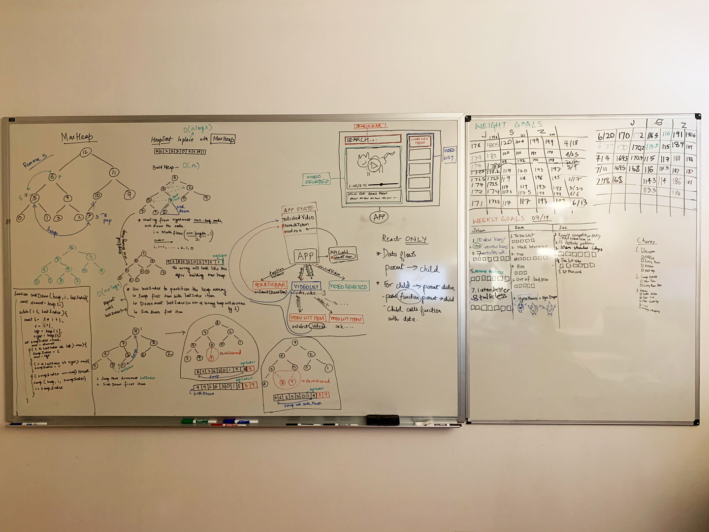
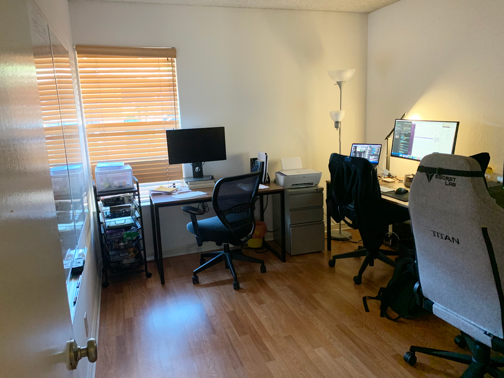

At the end of November 2019, after a long and exhaustive search, I moved in to an apartment in Sunnyvale, CA with [Julian](https://www.linkedin.com/in/juliantai/) and [Zac](https://www.linkedin.com/in/zac-cucinotta-411098182/). One of the main reasons why we picked this place was the extra room that was still within our budget. We wanted to have an office where we could work on personal projects, study, do leetcode problems — a space where we could hang out and motivate each other. Three days after we moved it, I got an excellent deal on a x feet whiteboard on craigslist and we covered one wall with two whiteboards (the total area is 9' x 4').

Now that we're stuck inside because of coronavirus, the extra office room has been pivotal to our lives during the quarantine. We turned the smaller whiteboard into a “goals” board. We do weekly check ins on Saturdays to check our progress and update our goals for the week on the board. Then every night we do daily check ins and check off the tasks we accomplished during the day. We've been doing this since around January and we've made TREMENDOUS progress with goals that we had put off doing for years. Here are some of our accomplishments:

1. We've lost a combined weight of over 50lbs (I don't feel sleepy after lunch anymore and we all need to buy new pants :D).
2. Julian has learned over 400 new kanjis and reviewed over 1200.
3. Zac is on his third project, he's done a machine learning course and he's been doing 5-10 leetcode problems per week (still can't beat me at splendor tho, Zac needs to do more bfs shortest path problems).
4. I started running again and went from feeling like I'm dying at half a minute to being able to do two laps(~2.2 miles) in our neighborhood in under 25 mins. Zac can do four laps easy and he started with 2.

We go on several walks a day, talk about bugs (and features), discuss algorithms and just life in general. When I'm struggling to be productive, I just go to the office and "steal energies". It's mid July and we've kept up our whiteboard board routine for over six months. I think the visual checkboxes and accountability have been key to our success.

It started out with me asking Zac to be my accountability buddy. Then Julian joined us and we started putting up our daily goals on the board. Even though things have been rough with coronavirus, and we're all stuck inside, it's not too bad and I'm really grateful to be learning and growing with amazing housemates!

A snapshot of our whiteboards from 07/19

Our office
