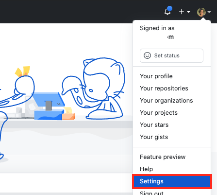
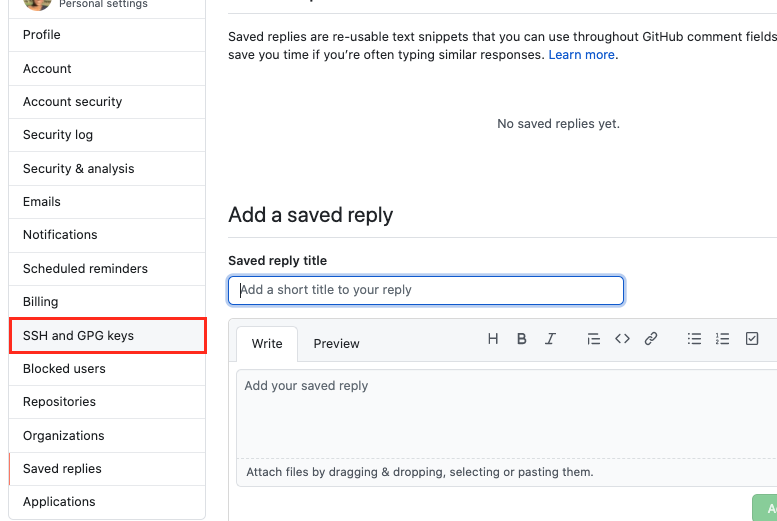
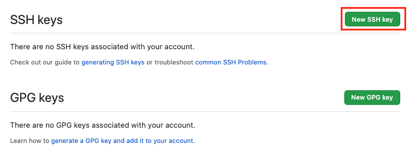
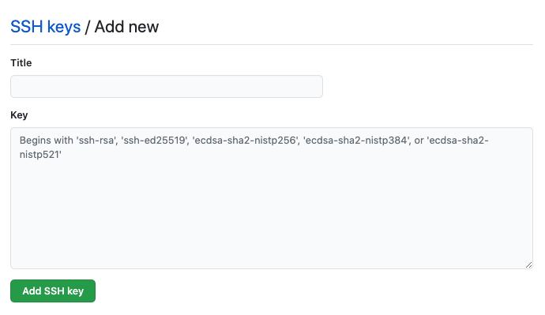

<span style="font-weight: 600;">Issue</span>:

1. You need to use two different github accounts from one computer.
2. You don't want to have to configure your ssh keys every time you switch accounts.
3. You don't want to edit the repo's ssh address every time you clone a repo either [as suggested by a lot of online tutorials](https://medium.com/@xiaolishen/use-multiple-ssh-keys-for-different-github-accounts-on-the-same-computer-7d7103ca8693).

<span style="font-weight: 600;">Solution</span>: You put all your work repos in one folder and update your ssh config to conditionally use a different SSH key. Everything else will use the default ssh key (your personal account).

Github uses the [SSH](https://en.wikipedia.org/wiki/Secure_Shell) protocol with the [RSA](<https://en.wikipedia.org/wiki/RSA_(cryptosystem)>) cryptosystem to authenticate your computer. When you generate a new SSH key, there will be two keys created - a private key and a public key. You'll need to add the _public_ key to your github account but leave the private key on your machine. You can read more about [public-key cryptography here](https://en.wikipedia.org/wiki/Public-key_cryptography).

If you've already generated and added your SSH keys to your github account, skip this section.

## Generating and Adding SSH keys to your github account.

### Checking for existing keys

1. First, check if there are SSH keys present on your machine by going to terminal and run `ls -al ~/.ssh` . By default, the filenames of the public keys start with `id_rsa` and end in `.pub` .
2. If you're not sure which key belongs to which account and want to start with new keys, you can delete your keys by running `ssh-add -D` from terminal. This only removes manually added keys so if you're running into issues, take a look at this [stackoverflow answer](https://stackoverflow.com/a/25465155/11279811). Make sure to go to the folder where your SSH keys are located - run `open ~/.ssh` from terminal and save a copy before overwriting them.

### Generating new keys

1. From terminal, run

   ```bash
   ssh-keygen -t rsa -f ~/.ssh/id_rsa -C "your.personal.email@example.com"
   ```

   If you get asked to overwrite an existing key of the same name, type `y` if you want to overwrite it. If you don't want to overwrite it, type `n` and reenter the above command with a new filename. Just change `id_rsa` to something else like `id_rsa_PERSONAL` .

2. Enter a secure passphrase. This will generate two a private key `id_rsa` and a public key `id_rsa.pub`.
3. Copy the public key `id_rsa.pub` by running `pbcopy < ~/.ssh/id_rsa.pub` from terminal. You can also open the SSH key directory by running `open ~/.ssh` , dragging the `id_rsa.pub` file into your code editor and copying the contents of the file.
4. From a browser, go to the settings of your github account by clicking your profile picture from the top right corner.

   

5. In the user settings sidebar, click `SSH and GPG keys` .

   

6. Click `New SSH key`

   

7. Paste your copied public key in the "**Key**" field and give it an appropriate title in the "**Title**" field.

   

8. Click `Add SSH key` .

Repeat the above steps to generate and add a new key for your second github account. Just make sure to give a different name like `id_rsa_COMPANY` .

## Setting up SSH config

1. From terminal, run `cd ~/.ssh` .
2. Check if a config file exists by running - `ls config` . If you see `ls: config: No such file or directory` , create a new config file by running `touch config` .
3. Open the config file by dragging it into your code editor.
4. Paste the following into the file:

   ```bash
     Host github.com
       HostName github.com
       User git
       IdentitiesOnly yes
       AddKeysToAgent yes
       UseKeychain yes

     Match Host github.com !exec "pwd | grep '/COMPANY' > /dev/null"
       IdentityFile ~/.ssh/id_rsa

     Match Host github.com exec "pwd | grep '/COMPANY' > /dev/null"
       IdentityFile ~/.ssh/id_rsa_$COMPANY
   ```

   [Source](https://gist.github.com/Hefeweizen/a4c6ffb6e06a87ac338ffce3d13512f1) for the above snippet.

   Setting `UseKeychain` to yes stores your passphrase in the keychain so you don't have to retype it every time. `exec "pwd | grep '/COMPANY' > /dev/null"` checks if the current folder is nested inside your `COMPANY` folder. If it is, it'll use `id_rsa_$COMPANY` SSH key and your default one otherwise. [1]

5. Then run `chmod 600 ~/.ssh/config` .

## Setting your user.name and user.email

Now that you've set up your SSH keys, you still need to configure your user.name and user.email variables. These determine what ends up in the author and committer field of commit objects. Without setting this, you'll be able to push to your work directory but if you want your commits to have your work email and name, you have set up your `.gitconfig` files.

1. Check if you have an existing `.gitconfig` in your root by running `ls ~/.gitconfig` . If you don't have one, create one by running `touch ~/.gitconfig` .
2. Do the same for your work directory.
3. Open the `.gitconfig` in your root and inside there add your personal git user name and email. Also include an `includeIf` path that tells git to use a different `.gitconfig` for your work repos.

   ```bash
   # ~/.gitconfig
   [user]
   email = your.email@example.com
   name = your-user-name
   [user]
   email = your.email@example.com
   name = your-user-name
   [includeIf "gitdir:~/PATH/TO/WORK/DIR/RELATIVE/TO/ROOT"]
       path = ~/PATH/TO/WORK/DIR/RELATIVE/TO/ROOT/.gitconfig
   ```

4. Inside the `.gitconfig` in your work directory, add your work email and work user name.

   ```bash
   # ~/PATH/TO/WORK/DIR/RELATIVE/TO/ROOT/.gitconfig
   [user]
   email = your.work.email@example.com
   name = your-work-user-name
   ```

Now you'll be able to use both git accounts with SSH and your commits will have the right email and name for author.

[1] Note: Detailed breakdown of `exec "pwd | grep '/COMPANY' > /dev/null"`:
`pwd` stands for `print working directory` . The `|` takes the standard output of the command on the left, and pipes it as standard input to the command on the right. `grep` searches plain text for a match. `>` redirects the results of the previous command to the file on the right. `/dev/null` is a "black hole" where all data written gets discarded. Read more about `/dev/null` [here](https://medium.com/@codenameyau/step-by-step-breakdown-of-dev-null-a0f516f53158#:~:text=To%20begin%2C%20%2Fdev%2Fnull,of%2Dfile%20EOF%20when%20read.).

So the command is basically saying to get your current working directory, search for your `COMPANY` name and discard the returned value. The exit code from this command will determine which SSH key to use.
