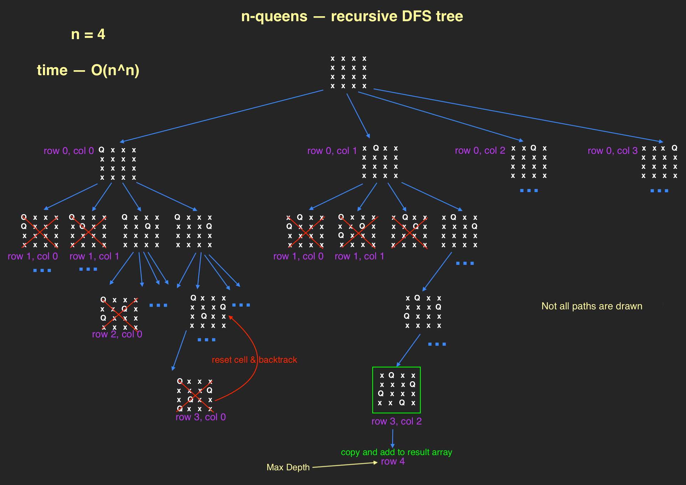
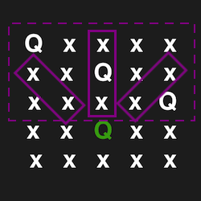
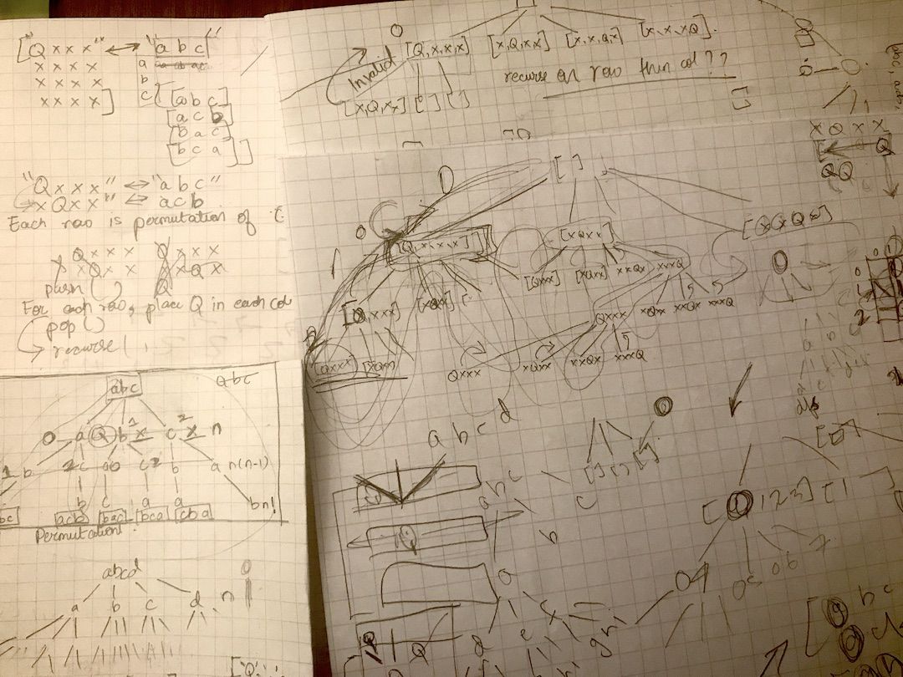

### Complete solution — brute force, recursive DFS and O(n^n) time

```js
// Main function
function solveNQueens(n) {
	const result = [],
		board = createBoard(n)

	// [0]
	function placeQueen(row) {
		//  [1]
		if (row === n) {
			result.push(deepCopyBoard(board))
			return
		}

		for (let col = 0; col < n; col++) {
			// [2]
			board[row][col] = 'Q'
			if (isValidCell(board, row, col)) placeQueen(row + 1)
			board[row][col] = '.'
		}
	}

	placeQueen(0)
	return result
}
/*
Notes:
  [0] DFS recursive function recurses on row then loops through columns.
  [1] Base case is handled inside loop so don't need to pass column as param.
      So, only completely valid board will reach the end.
  [2] Place queen and go to next move if valid. Otherwise 'backtrack'.
*/

// Helpers:
// Check if a cell is valid
function isValidCell(board, row, col) {
	let upCol_row = row - 1
	while (upCol_row > -1) {
		if (board[upCol_row][col] === 'Q') return false
		upCol_row--
	}

	let upDiaLeft = { col: col - 1, row: row - 1 }
	while (upDiaLeft['row'] > -1 && upDiaLeft['col'] > -1) {
		if (board[upDiaLeft['row']][upDiaLeft['col']] === 'Q') return false
		upDiaLeft['row']--
		upDiaLeft['col']--
	}

	let upDiaRight = { col: col + 1, row: row - 1 }
	while (upDiaRight['row'] > -1 && upDiaRight['col'] < board.length) {
		if (board[upDiaRight['row']][upDiaRight['col']] === 'Q') return false
		upDiaRight['row']--
		upDiaRight['col']++
	}
	return true
}

function createBoard(n) {
	const board = []
	for (let i = 0; i < n; i++) {
		const elem = new Array(n).fill('.')
		board.push(elem)
	}
	return board
}

function deepCopyBoard(board) {
	const copy = []
	for (const row of board) {
		copy.push(row.slice(0).join(''))
	}
	return copy
}

console.log(solveNQueens(4))
```

<a href="/assets/img/n-queens-tree.png" target="_blank">
  
</a>

## First Intuition and Strategy

I started by drawing out a solved 4 x 4 board. Since each row is some permutation of 'Qxxx' I pulled up [the permutations problem](/posts/0046-permutations/) that I did a couple days ago and drew out the tree for it. After that, it wasn't as difficult to draw up a tree for n-queens that seemed promising. I tried to use the permutations problem as reference to code it up but I couldn't get it right. I really struggled here and this took up the major bulk of the two hours.

My code was getting hard to read(it was more console.logs than actual code at this point) so I decided to just delete everything and start again. This time I started with writing the stuff I knew how to do. Writing modular code was VERY helpful. I wrote and tested each helper function until I was 100% they were good. Cleaning the clutter made it easier to think about the "meat" of the problem.

### Helper functions

`isValidCell` checks if a queen placement is valid. From the tree diagram that I drew, I knew I just had to check the top half of the board. This approach is brute force and there is a more optimal way that I still need to implement.



```js
// TODO: Optimize
function isValidCell(board, row, col) {
	// Vertical column check
	let upCol_row = row - 1
	while (upCol_row > -1) {
		if (board[upCol_row][col] === 'Q') return false
		upCol_row--
	}

	// Top half Diagonal left check
	let upDiaLeft = { col: col - 1, row: row - 1 }
	while (upDiaLeft['row'] > -1 && upDiaLeft['col'] > -1) {
		if (board[upDiaLeft['row']][upDiaLeft['col']] === 'Q') return false
		upDiaLeft['row']--
		upDiaLeft['col']--
	}

	// Top half Diagonal right check
	let upDiaRight = { col: col + 1, row: row - 1 }
	while (upDiaRight['row'] > -1 && upDiaRight['col'] < board.length) {
		if (board[upDiaRight['row']][upDiaRight['col']] === 'Q') return false
		upDiaRight['row']--
		upDiaRight['col']++
	}

	return true
}
```

Other helper functions:

```js
function createBoard(n) {
	const board = []
	for (let i = 0; i < n; i++) {
		const elem = new Array(n).fill('.')
		board.push(elem)
	}
	return board
}

/* Copy and format board to what leetcode wants. */
function deepCopyBoard(board) {
	const copy = []
	for (const row of board) {
		copy.push(row.slice(0).join(''))
	}
	return copy
}
```

But I was still struggling with getting the recursive function and parameters right. Here's what the failing code looked like:

```js
// THIS DOESN'T WORK
function placeQueen(board, row, col) {
	const isValid = isValidCell(board, row, col)
	// backtrack
	if (!isValid) return
	// valid board
	if (row + 1 === n && isValid) {
		result.push(deepCopyBoard(board))
		return
	}
	// base case
	if (row + 1 === n) return

	for (let col = 0; col < n; col++) {
		board[row][col] = 'Q'
		placeQueen(board, row + 1, col)
		board[row][col] = '.'
	}
}
```

So I wrote a recursive function that just prints all placements of the queens. I didn't need to pass the column number as a parameter in this function so I decided to do the same when solving n-queens which forced me to move the `isValidCell` check inside the for loop. AND LIKE MAGIC IT WORKED!!!! :D

### Recursive Function that "pretty" prints all n-queens placement (valid or invalid)

```js
function dfsBoard(n) {
	const board = createBoard(n),
		result = []

	function recurse(row) {
		// Base Case
		if (row === n) {
			result.push(deepCopyBoard(board))
			return
		}

		for (let c = 0; c < n; c++) {
			board[row][c] = 'Q '
			recurse(row + 1)
			board[row][c] = 'x '
		}
	}

	recurse(0)
	prettyPrintNQueens(result)
}

function createBoard(n) {
	const board = []
	for (let i = 0; i < n; i++) {
		board.push([])
		for (let j = 0; j < n; j++) {
			board[i][j] = 'x '
		}
	}

	return board
}

// "Pretty" printing the boards made it easier to see what was going on with the recursive calls
function prettyPrintNQueens(board) {
	for (const row of board) {
		console.log('---')
		for (const col of row) {
			console.log(col)
		}
	}
}

dfsBoard(3) // Will log the following for n = 3
/* 
-----
Q x x 
Q x x 
Q x x 
-----
Q x x 
Q x x 
x Q x 
-----
Q x x 
Q x x 
x x Q 
-----
Q x x 
x Q x 
Q x x 
-----
Q x x 
x Q x 
x Q x 
-----
Q x x 
x Q x 
x x Q 
-----
Q x x 
x x Q 
Q x x 
-----
Q x x 
x x Q 
x Q x 
-----

...so on
*/
```

Figuring out n-queens on paper first


Tests:

```js
// Tests
console.log(solveNQueens(4))
/* 
n = 4
[ 
 [".Q..",
  "...Q",
  "Q...",
  "..Q."],

 ["..Q.",
  "Q...",
  "...Q",
  ".Q.."]
]
*/
console.log(solveNQueens(5))
/* 
n = 5
[
  ['Q....', '..Q..', '....Q', '.Q...', '...Q.'],
  ['Q....', '...Q.', '.Q...', '....Q', '..Q..'],
  ['.Q...', '...Q.', 'Q....', '..Q..', '....Q'],
  ['.Q...', '....Q', '..Q..', 'Q....', '...Q.'],
  ['..Q..', 'Q....', '...Q.', '.Q...', '....Q'],
  ['..Q..', '....Q', '.Q...', '...Q.', 'Q....'],
  ['...Q.', 'Q....', '..Q..', '....Q', '.Q...'],
  ['...Q.', '.Q...', '....Q', '..Q..', 'Q....'],
  ['....Q', '.Q...', '...Q.', 'Q....', '..Q..'],
  ['....Q', '..Q..', 'Q....', '...Q.', '.Q...']
]
*/

console.log(solveNQueens(0))
```
