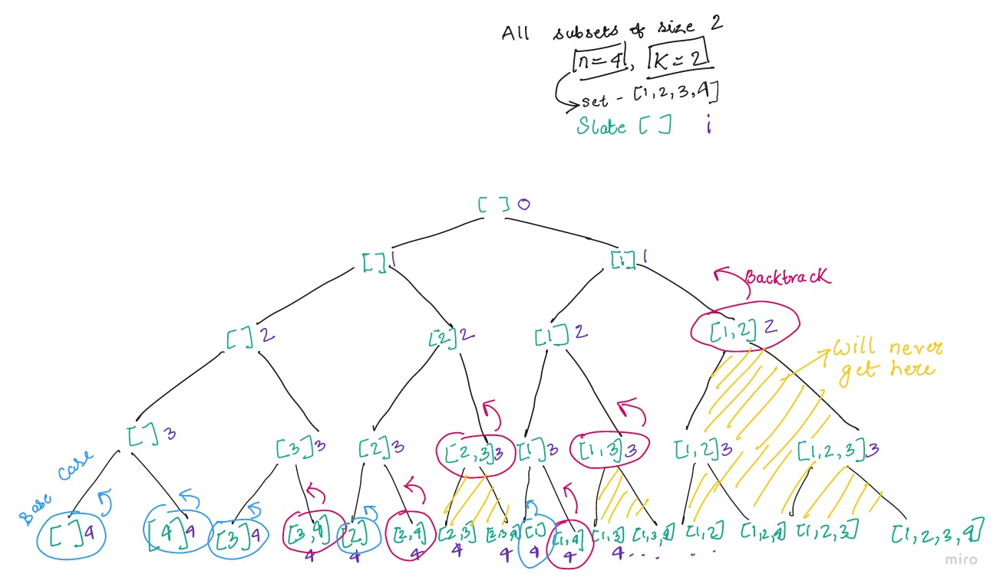

### Recursive Backtracking

```js
/* 
Time Complexity - O(n * 2^n) - some nodes cause of backtracking
Space Complexity - O(n * 2^n) - some nodes cause of backtracking
*/
function combine(n, k) {
	const result = []

	function subsetHelper(slate, i) {
		// Backtracking case
		if (slate.length === k) {
			result.push(slate.slice(0))
			return
		}
		// Base case
		if (i === n + 1) {
			return
		}
		// Recursive case
		subsetHelper(slate, i + 1)
		slate.push(i)
		subsetHelper(slate, i + 1)
		slate.pop()
	}

	subsetHelper([], 1)
	return result
}

// Tests

console.log(combine(4, 2))
console.log(combine(5, 2))
```

<span style="display:block; text-align: center;">Tree Diagram - Backtracking</span>

