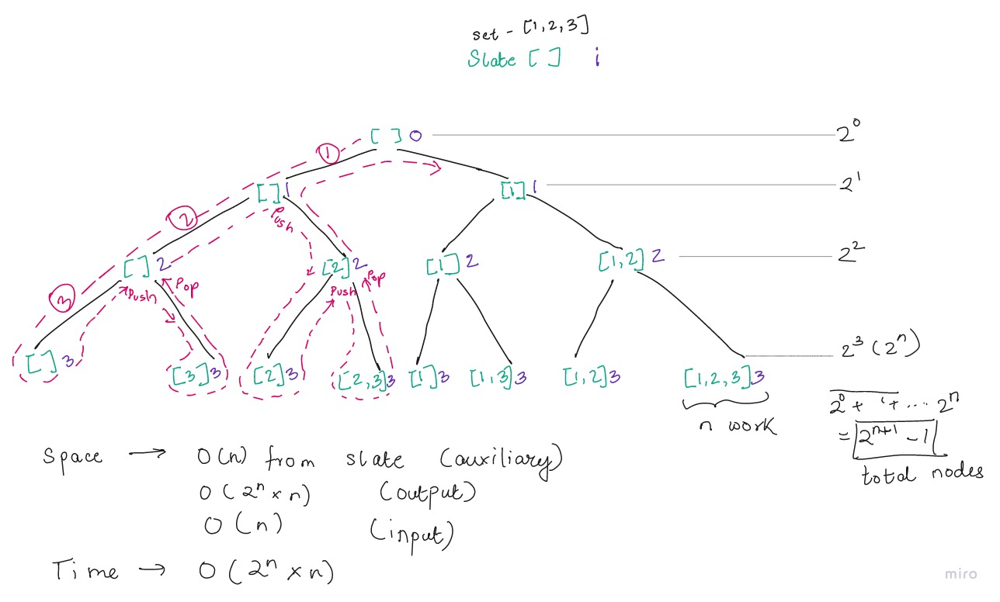

### Recursive BFS

```js
/* 
Time Complexity - O(n * 2^n)
Space Complexity - O(n * 2^n)
*/
// Passing down copy of array of size n -1 for sub problem and a copy of slate for include
function subsets(nums) {
	const result = []

	function subsetHelper(slate, array) {
		if (array.length === 0) result.push(slate)
		else {
			// exclude
			subsetHelper(slate, array.slice(1))
			// include
			subsetHelper([...slate, array[0]], array.slice(1))
		}
	}

	subsetHelper([], nums)
	return result
}
```

```js
// Passing down reference to slate and position i for array
function subsets(array) {
	const result = []

	function subsetHelper(slate, i) {
		if (i === array.length) result.push(slate.slice(0))
		else {
			// exclude
			subsetHelper(slate, i + 1)
			// include
			slate.push(array[i])
			subsetHelper(slate, i + 1)
			slate.pop()
		}
	}

	subsetHelper([], 0)
	return result
}
```

<span style="display:block; text-align: center;">Tree Diagram - Time Complexity and Recursive path</span>


Tests:

```js
// Tests
console.log(subsets([1, 2, 3]))
console.log(subsets(['a', 'b', 'c', 'd']))
```
