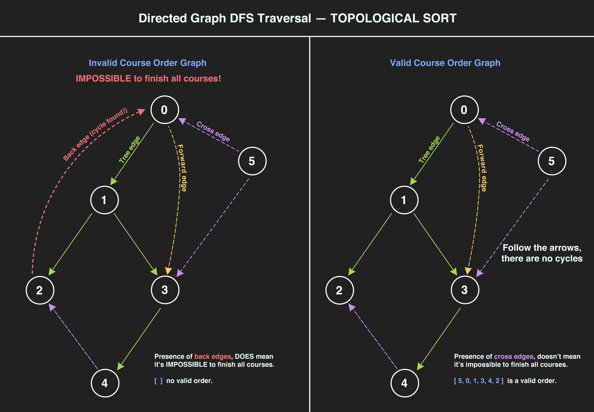

> Note: This is topological sort. [Wiki link.](https://en.wikipedia.org/wiki/Topological_sorting)

Related Problem: [207. Course Schedule](/posts/0207-course-schedule/).

<a href="/img/graphs_dfs_directed_course_select.jpg" target="_blank">

</a>

DFS on Directed Graph:

```js
var findOrder = function (numCourses, prerequisites) {
	const n = numCourses,
		adjList = buildGraph(n, prerequisites),
		visited = new Array(n).fill(-1),
		arrival = new Array(n).fill(-1),
		departure = new Array(n).fill(-1),
		topSort = []

	let timestamp = 0

	for (let v = 0; v < n; v++) {
		if (visited[v] === -1) {
			// if cycle found, you cannot complete the courses
			if (dfs(v)) return []
		}
	}

	return topSort.reverse() // no cycle found anywhere

	// -----------------------------------------------
	function dfs(source) {
		arrival[source] = timestamp
		timestamp++
		visited[source] = 1

		for (const neighbor of adjList[source]) {
			if (visited[neighbor] === -1) {
				if (dfs(neighbor)) return true
			} else {
				// This is a back edge, hence a cycle
				if (departure[neighbor] === -1) return true
			}
		}

		departure[source] = timestamp
		timestamp++
		topSort.push(source)

		return false
	}

	// -----------------------------------------------
	function buildGraph(n, edges) {
		const adjList = new Array(n).fill().map(() => [])

		for (const [src, dest] of edges) {
			adjList[dest].push(src)
		}

		return adjList
	}
}

// tests

console.log(
	findOrder(4, [
		[1, 0],
		[2, 0],
		[3, 1],
		[3, 2],
	])
)
console.log(
	findOrder(6, [
		[1, 0],
		[2, 1],
		[3, 1],
		[4, 3],
		[3, 0],
		// [0, 2],
		[2, 4],
		[3, 5],
		[0, 5],
	])
)
```
