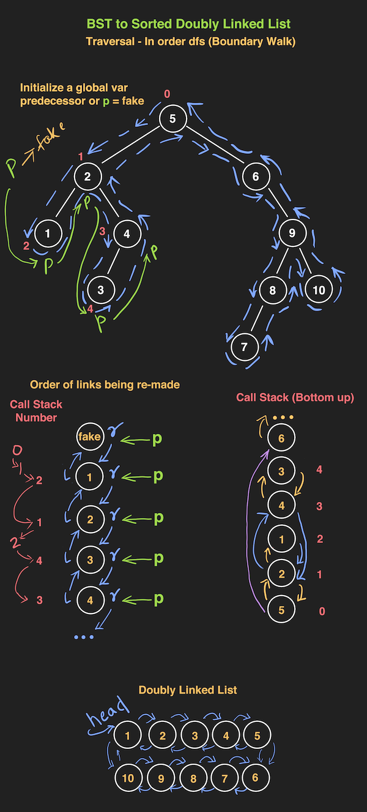

```js
// Boundary Walk - Inorder dfs
var treeToDoublyList = function (root) {
	// recursive helper
	function dfs(node) {
		if (node.left) dfs(node.left)
		pred.right = node
		node.left = pred
		pred = node
		if (node.right) dfs(node.right)
	}

	// Overall
	if (!root) return root

	let fake = new TreeNode('fake'),
		pred = fake

	dfs(root)

	const head = fake.right
	pred.right = head
	head.left = pred

	return head
}

// TreeNode
function TreeNode(val, left, right) {
	this.val = val === undefined ? 0 : val
	this.left = left === undefined ? null : left
	this.right = right === undefined ? null : right
}
```


Tests:

```js
// tests
const tree = {
	val: 5,
	left: {
		val: 2,
		left: { val: 1, left: null, right: null },
		right: { val: 4, left: { val: 3, left: null, right: null }, right: null },
	},
	right: {
		val: 6,
		left: null,
		right: {
			val: 9,
			left: { val: 8, left: { val: 7, left: null, right: null }, right: null },
			right: { val: 10, left: null, right: null },
		},
	},
}

let head = treeToDoublyList(tree)

const rootVal = head.val
node = head.right
console.log(rootVal)
while (node.val !== rootVal) {
	console.log(node.val)
	node = node.right
}
```
