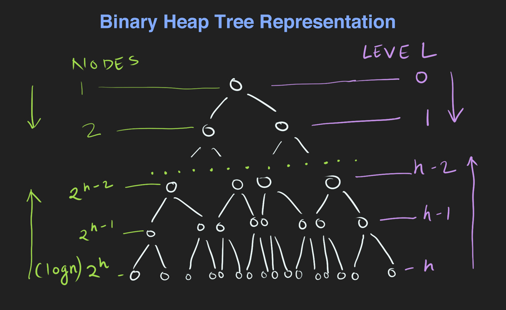
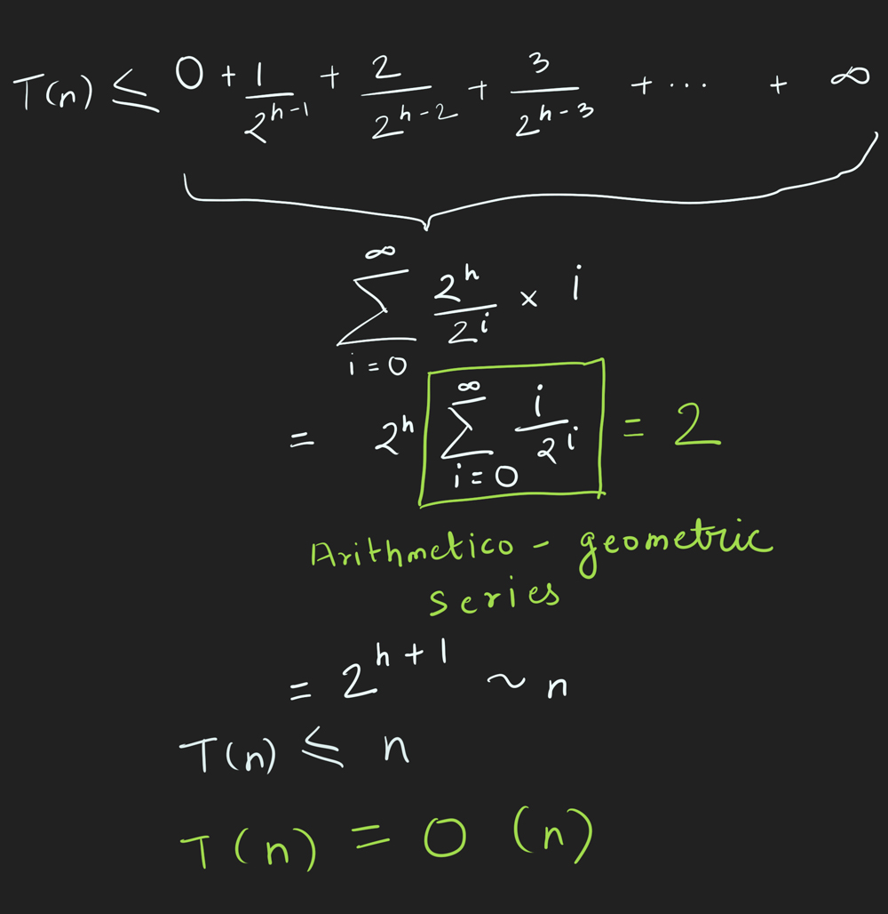

<span style="display:block; text-align: center;">Wiki pic - Graphical example of heap sort. [Source.](https://en.wikipedia.org/wiki/Heapsort)</span>

## In-place heap sort:

<p style="margin-bottom: 0.75rem;">Given an unsorted array,</p>

1. Build a max heap in place using `buildMaxHeap` function.
2. Loop through the items of the heap.
3. Instead of extracting and removing the max from the heap, swap it with last item of the heap and decrement heap size.
4. "Heapify" or sink down the swapped item which is at `index 0`.

<!-- embed:heap_sort_in_place.js -->

Explanation for time complexity of `buildMaxHeap` and why it is O(n):



```js
/* 
Time Complexity of building a max heap in place is O(n).
This is because of the structure of a binary heap.

| no. of nodes | Level | height - level | work done to sink down nodes | % of tree nodes |
| ------------ | ----- | -------------- | ---------------------------- | --------------- |
| 1            | 0     | h              | 1 * h                        | ...             |
| 2            | 1     | h - 1          | 2 * h-1                      | ...             |
...
| 2^h-2        | h-2   | 2              | 2^h-2 * 2                    | 12.5%           |
| 2^h-1        | h-1   | 1              | 2^h-1 * 1                    | 25%             |
| 2^h          | h     | 0              | 2^h * 0                      | 50%             |

                                         T(n) = sum of this column

T(n) = sum of this column
T(n) = 2^h * 0 + 2^h-1 * 1 + 2^h-2 * 2 + ... + 2 * h-1 + 1 * h
                                                             |
height of tree = log(n), so we can replace the last h with log(n)

T(n) = 2^h * 0 + 2^h-1 * 1 + 2^h-2 * 2 + ... + 2 * h-1 + 1 * log(n)

Subbing out the log(n) with ∞, we can say that T(n) of n items <= T(n) of ∞ items
*/
```

Rewriting and solving the equation, we get:



[Link to wiki on arithmetico-geometric series](https://en.wikipedia.org/wiki/Arithmetico%E2%80%93geometric_sequence#Example:_application_to_expected_values).

If you look at the table and the percentages of number of nodes per level, you'll notice that 87.5% of nodes are in the last three levels which don't need much work and 50% of nodes don't need any work at all to sink down. So `O(n)` isn't really that surprising.

## Heap sort with `O(n)` auxiliary space:

<p style="margin-bottom: 0.75rem;">Given an unsorted array,</p>

1. Create a min heap using `MinBinaryHeap` data structure.
2. Loop through array items and insert each item into the min heap.
3. Initialize an empty auxiliary array to hold sorted values.
4. Until there are items in the heap, keep extracting min from the min heap and pushing it into the sorted array.

[Link to Binary Heap](/posts/binary-heap/)

<!-- embed:heap_sort.js -->
