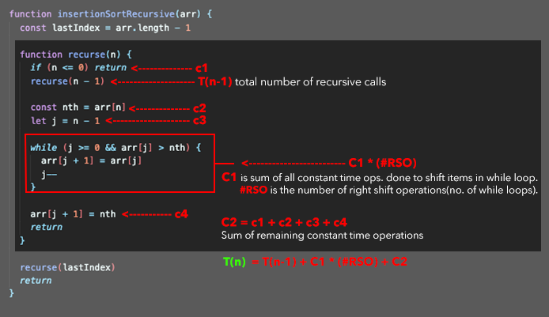
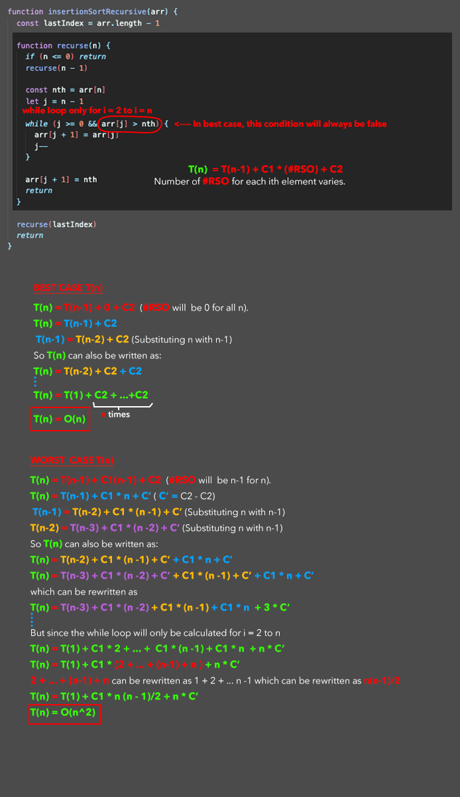

Wiki pic - Graphical example of insertion sort. [Source.](https://en.wikipedia.org/wiki/File:Insertion-sort-example-300px.gif)

## Recursive Insertion Sort

<!-- embed:insertion_sort_recursive.js -->

### Calculating the Time Complexity of Recursive Insertion Sort

## Iterative Insertion Sort

<!-- embed:insertion_sort_iterative.js -->
