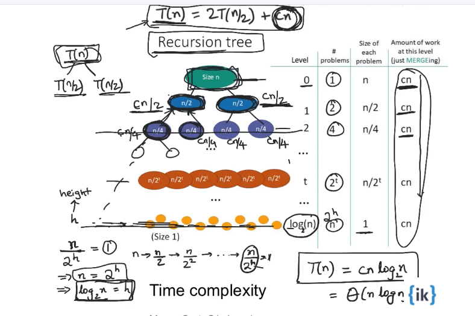

Wiki pic - Graphical example of merge sort. [Source.](https://en.wikipedia.org/wiki/Merge_sort)

## Merge Function

The `merge` function that compares and merges left and right halves or array will be common for both recursive and iterative merge sort.

<!-- embed:merge.js -->

## Recursive Merge Sort

<!-- embed:merge_sort.js -->

### Calculating the Time Complexity of Recursive Merge Sort

## Iterative or "Bottom Up" Merge Sort

Merge sort can be solved iteratively in a bottom up way. Instead of recursively dividing the array into two halves and merging when you've reached the bottom, you can use two loops and an interval to keep track of which sections of the array you're merging. You don't recurse to the bottom and then return back from the recursive calls. You just start from the bottom which is why it's called "bottom up" merge sort. Intervals will be multiples of 2 because you'll be doubling the number of elements with each merge.

<!-- embed:merge_sort_iterative.js -->
